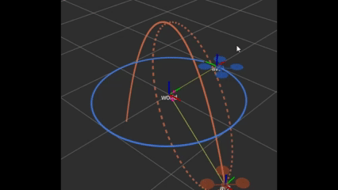
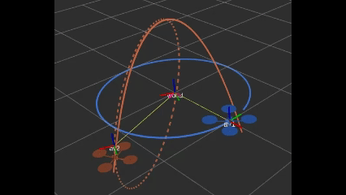

# MIT 16.485 - Visual Navigation for Autonomous Vehicles 

## Overview
This repo contains my implementation to MIT's VNAV course labs. Linked [here](https://vnav.mit.edu/)

## Setup
Clone the repo:

```
git clone https://github.com/griff-p/VNAV.git
cd VNAV
```
Create a workspace and link:
```
mkdir -p ~/vnav_ws/src
ln -s $(pwd)/lab2/two_drones_pkg ~/vnav_ws/src/
cd ~/vnav_ws
```

## Lab 2
Lab 2 serves as an introduction to ROS and the tf package.



*Figure: Lab 2 simulation showing TF broadcasting and plot publisher in action. (world frame)*



*Figure: Lab 2 simulation in av1 reference frame. Drone 2's trajectory goes from parabolic to ellipse.*

To run:
Build:
```
colcon build 
```
Source:
```
source install/setup.bash
```
Run:
```
ros2 launch two_drones_pkg two_drones.launch.yaml
```

## Lab 3 - 9

In progress.
